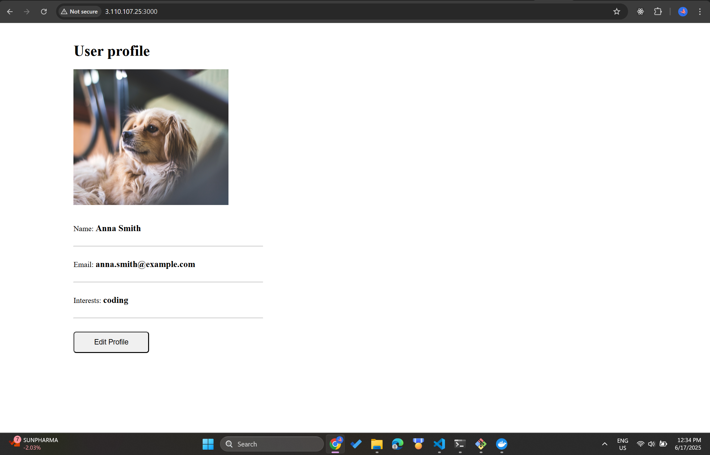
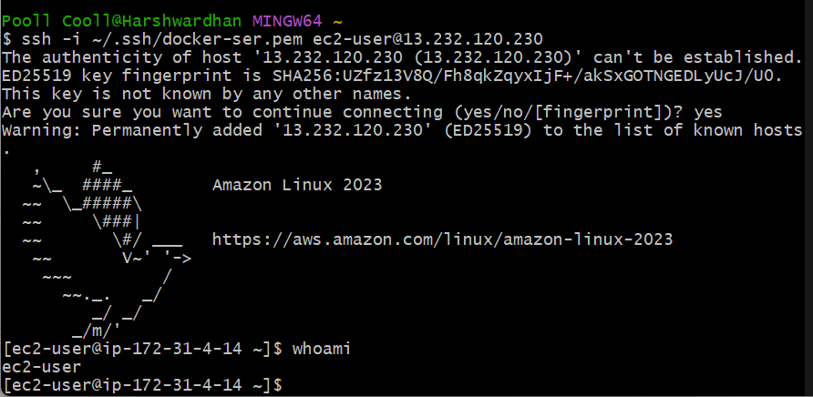
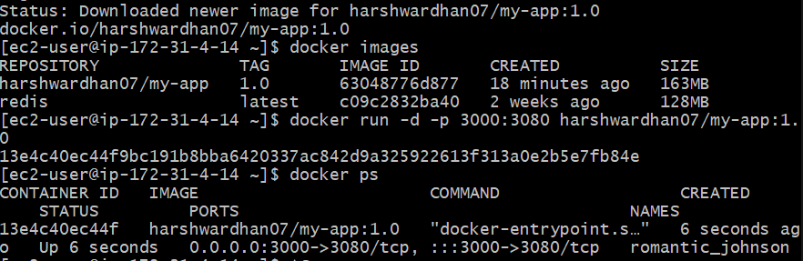
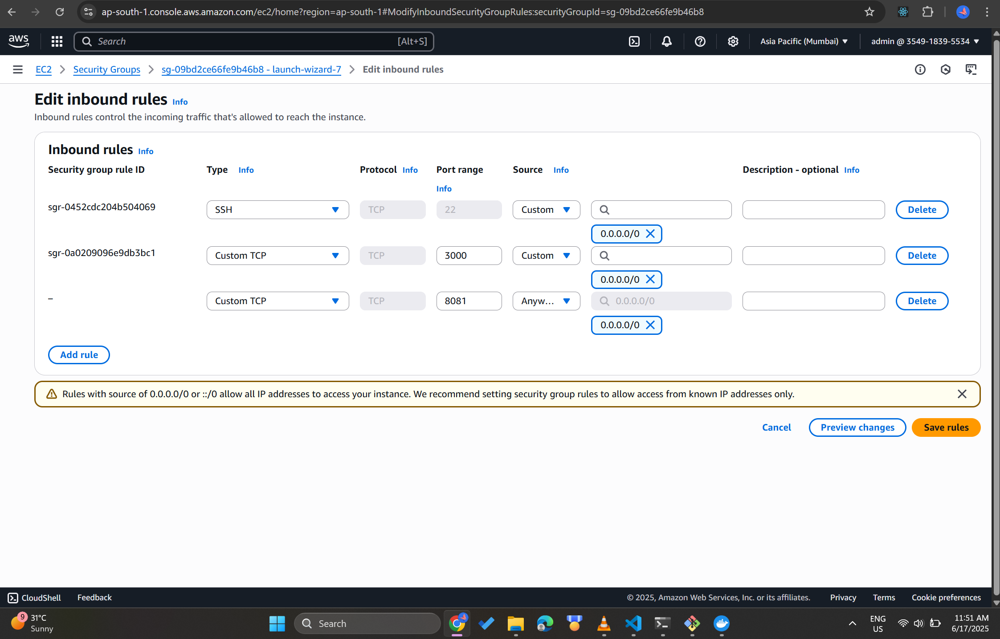
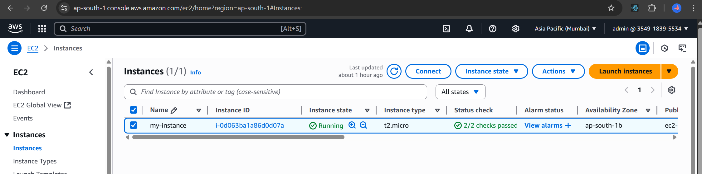

# EC2 Docker Deployment Guide
I tried it myself and provided all the steps for you as well as me so both of us can learn. Let's learn together!



## Prerequisites

- AWS EC2 instance launched
- Key pair file (`docker-server.pem`) downloaded
- Basic understanding of Docker and AWS

## Table of Contents

1. [EC2 Instance Setup](#ec2-instance-setup)
2. [Docker Installation](#docker-installation)
3. [MongoDB Setup](#mongodb-setup)
4. [Application Deployment](#application-deployment)
5. [Security Group Configuration](#security-group-configuration)
6. [Verification](#verification)

## EC2 Instance Setup

### 1. Prepare SSH Key

Move your key pair file to the SSH directory and set proper permissions:

```bash
mv Downloads/docker-server.pem ~/.ssh/
ls -l .ssh/docker-server.pem
chmod 400 .ssh/docker-server.pem
```

### 2. Connect to EC2 Instance

```bash
ssh -i ~/.ssh/docker-server.pem ec2-user@<public-ip-address>
```



## Docker Installation

### 1. Update System Packages

```bash
sudo yum update
```

### 2. Install Docker

```bash
sudo yum install docker
```

### 3. Start Docker Service

```bash
sudo service docker start
ps aux | grep docker
```

### 4. Add User to Docker Group

```bash
sudo usermod -aG docker $USER
```

**Note:** You need to exit and reconnect for the group changes to take effect.

```bash
exit
ssh -i ~/.ssh/docker-server.pem ec2-user@<public-ip-address>
```

### 5. Verify Docker Installation

```bash
docker ps
docker login
```

## MongoDB Setup

### 1. Create Docker Network

```bash
docker network create mongo-network
```

### 2. Start MongoDB Container

```bash
docker run -d \
  -p 27017:27017 \
  -e MONGO_INITDB_ROOT_USERNAME=admin \
  -e MONGO_INITDB_ROOT_PASSWORD=password \
  --name mongodb \
  --net mongo-network \
  mongo
```

### 3. Start Mongo Express (Web UI)

```bash
docker run -d \
  -p 8081:8081 \
  -e ME_CONFIG_MONGODB_ADMINUSERNAME=admin \
  -e ME_CONFIG_MONGODB_ADMINPASSWORD=password \
  --net mongo-network \
  --name mongo-express \
  -e ME_CONFIG_MONGODB_SERVER=mongodb \
  -e ME_CONFIG_MONGODB_URL=mongodb://mongodb:27017 \
  mongo-express
```

### 4. Access Mongo Express

Navigate to: `http://<your-ec2-public-ip>:8081`

**Credentials:**
- Username: `admin`
- Password: `pass`

**Database Setup:**
- Create database: `user-account`
- Create collection: `users`

## Application Deployment

### 1. Deploy Application Container

```bash
docker run -d \
  -p 3000:3000 \
  --net mongo-network \
  --name my-app \
  harshwardhan07/my-app:1.0
```

### 2. Verify Deployment

```bash
docker images
docker ps
```



## Security Group Configuration

Add an inbound rule for port 3000 (same for port 8081 and 22) in your EC2 Security Group:

- **Type:** Custom TCP
- **Port:** 3000
- **Source:** 0.0.0.0/0 (or your specific IP range)



## Verification

After configuring the Security Group, access your application:

**Application URL:** `http://<your-ec2-public-ip>:3000`

🎉 **Yay! now running on EC2!**


## EC2 Instance Overview



## Troubleshooting

### Common Issues

1. **Permission denied for SSH key:**
   - Ensure key permissions are set to 400: `chmod 400 ~/.ssh/docker-server.pem`

2. **Docker commands require sudo:**
   - Make sure you've added your user to the docker group and reconnected

3. **Application not accessible:**
   - Verify Security Group inbound rules
   - Check if containers are running: `docker ps`

4. **MongoDB connection issues:**
   - Ensure all containers are on the same network
   - Verify MongoDB container is running

---

**Note:** Replace `<your-ec2-public-ip>` with your actual EC2 instance's public IP address throughout the commands.